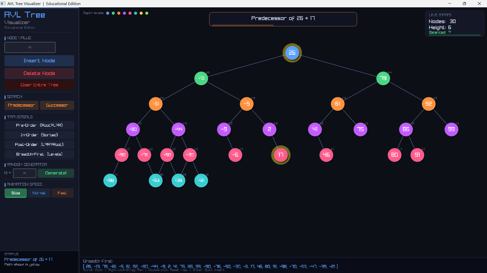

# 🌳 AVL Tree Visualizer | Pro Educational Edition


A professional, interactive educational tool built from scratch with **C++** and **Raylib**. This application visualizes Binary Search Trees and demonstrates real-time **AVL Auto-Balancing**. Watch your data structures come to life with dynamic animations, intuitive controls, and extensive traversal options!

> *Designed to make learning Data Structures and Algorithms (DSA) highly visual, intuitive, and fun.*

---

## 🌟 Visual Showcase

Here is the main interface showing a complex, color-coded AVL tree after multiple insertions, proving how it maintains its balance automatically.



### 🎥 Demo & Explanation
Watch a full walkthrough of the visualizer, the features, and the underlying logic:
👉 **[Click Here to Watch the Demo Video](INSERT_YOUR_YOUTUBE_LINK_HERE)**

### 📥 Download & Play
Want to try it out without compiling? Download the ready-to-use executable:
👉 **[Download the Latest Release (Windows .exe)](INSERT_YOUR_DOWNLOAD_LINK_HERE)**

---

## 🚀 How to Build and Run

To run the project from the source code, make sure you have a C++ compiler (like GCC/MinGW) and the Raylib library installed.

### 🪟 For Windows (MinGW):
Make sure `raylib.dll` and `libraylibdll.a` are in the same directory, then run:
```bash
#Go to directory
cd BST-program

# Compile the source code
g++ BST.cpp -o BST.exe -O2 -Wall -Wno-missing-braces -I . -L . -lraylibdll -lopengl32 -lgdi32 -lwinmm

# Run the executable
.\BST.exe
🐧 For Linux:Make sure Raylib is installed on your system, then run:Bash# Compile the source code
g++ BST.cpp -o avl_visualizer -lraylib -lGL -lm -lpthread -ldl -lrt -lX11

# Run the executable
./avl_visualizer
🔥 Pro Features IncludedThis visualizer is packed with advanced features designed for both learning and practical testing.🧠 Core AVL Operations & AnimationAnimated AVL Insertions: Insert nodes and watch the algorithm perform the necessary LL, RR, LR, or RL rotations with smooth animations.Complex Deletions: Delete any node safely. Watch the tree find the In-Order Successor for nodes with two children, replace it, and re-balance itself.Speed Control: Toggle animation speeds (1x Slow, 2x Normal, 4x Fast) to closely observe complex rotations or speed through large generations.Random Tree Generator: Instantly generate a random, fully-balanced AVL tree with a custom number of nodes to test edge cases.Clear ALL Tree: Wipe the entire tree structure to start over instantly with a single click.📊 Live Tree Statistics (Real-Time)A dedicated panel in the top-right corner displays live tree metrics:Total Nodes: Real-time count of all nodes currently in the tree.Tree Height: Live calculation of the tree's height.Balance Status: Real-time indicator confirming if the tree is currently Balanced or Unbalanced.🔍 Search, Successor & PredecessorFind Predecessor / Successor: Calculates and displays the in-order predecessor or successor of any input value.🌟 Path Highlighting: When searching, the tool glows the entire search path in yellow, visually teaching you exactly how the tree is traversed.🖨️ Complete Traversal PrintingDisplay the contents of your tree in any of the four standard traversal methods. The results are formatted as a clear vector (e.g., [ 15, 30, 45 ]) directly on the screen.MethodDescriptionPrint Pre-OrderRoots first, then left and right subtrees.Print In-OrderPrints data in sorted (ascending) order.Print Post-OrderNodes are processed after their descendants.Print Breadth-FirstProcesses nodes level by level (Level-Order).🎨 Modern Visual & UX ExperienceLevel-Based Coloring: Each tree level is automatically assigned a distinct, high-contrast color for immediate structural recognition.Nielsen’s Accessibility: Large, clear UI elements, readable fonts, and informative popup messages for every action.Advanced Camera System (Zoom & Pan):Mouse Wheel: Smoothly zoom in and out to handle huge trees.Right Click & Drag: Pan across the infinite canvas to explore large structures.🛠️ Technology Stack & LibrariesThis project was built entirely in C++ using the following open-source libraries:Raylib: A highly efficient, hardware-accelerated library for drawing 2D graphics, camera logic, and animations.Raygui: A simple and easy-to-use immediate-mode GUI library used for the buttons, value boxes, and toggle switches.🎮 ControlsLeft Click: Interact with the Control Panel (Insert, Delete, Generate).Mouse Wheel: Zoom In / Zoom Out.Right Click (Hold) + Drag: Move the camera around the tree.ESC Key: Exit the application.🤝 ContributingContributions, issues, and feature requests are highly welcome! Feel free to check the issues page if you want to contribute.📄 LicenseThis project is open-source and available under the MIT License.